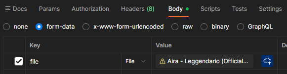

# ARIA – Demo Flow (Prototipo Verticale)

## 0. Avvio sistema

```bash```
```
docker compose up --build -d
```

### Verifica servizi:

Catalog → http://localhost:8081/ping

Rights → http://localhost:8082/ping

Royalties → http://localhost:8083/ping

MinIO Console → http://localhost:9001  (user: minio , pw: minio12345)

Entrare su MinIO console e creare il bucket "aria-audio"

## 1. Creazione traccia

POST http://localhost:8081/tracks

```BODY json```
```
{
  "artistId": "11111111-1111-1111-1111-111111111112",
  "title": "Leggendario",
  "description": "singolo",
  "genre": "Trap",
  "durationSec": 192
}
```
Expected 201 created:
```
{
    "trackId": "d3ab7308-9f5a-40dc-b993-cbc79581b133",
    "artistId": "11111111-1111-1111-1111-111111111112",
    "title": "Leggendario",
    "status": "DRAFT"
}
```

## 2. Upload audio

POST http://localhost:8081/tracks/{trackId}/audio

```Body → form-data → file```



Expected 200 OK:
```
Uploaded: tracks/d3ab7308-9f5a-40dc-b993-cbc79581b133/audio
```
audio salvato su MinIO + storageKey aggiornato

## 3. Submit traccia

PUT http://localhost:8081/tracks/{trackId}/submit

```Requisiti: deve avere audio```

Expected 200 OK: 
```
{
    "trackId": "d3ab7308-9f5a-40dc-b993-cbc79581b133",
    "artistId": "11111111-1111-1111-1111-111111111112",
    "title": "Leggendario",
    "status": "SUBMITTED"
}
```

## 4. Creazione licenza (Rights)

POST http://localhost:8082/licenses

```BODY json```
```
{
  "trackId": "d3ab7308-9f5a-40dc-b993-cbc79581b133",
  "rightsHolderId": "22222222-2222-2222-2222-222222222222",
  "streamingAllowed": true
}
```

Expected 201 Created: 
```
{
    "licenseId": "c10f1cca-16e7-4a5a-a236-2159453adcb4",
    "trackId": "d3ab7308-9f5a-40dc-b993-cbc79581b133",
    "rightsHolderId": "22222222-2222-2222-2222-222222222222",
    "streamingAllowed": true
}
```

## 5. Publish traccia

PUT http://localhost:8081/tracks/{trackId}/publish

```Requisiti: deve essere SUBMITTED + deve esistere licenza```

Expected 200 OK :
```
{
    "trackId": "d3ab7308-9f5a-40dc-b993-cbc79581b133",
    "artistId": "11111111-1111-1111-1111-111111111112",
    "title": "Leggendario",
    "status": "PUBLISHED"
}
```

## 6. Simulazione stream

POST http://localhost:8081/tracks/{trackId}/play

```Requisiti: una traccia deve essere PUBLISHED per essere riprodotta```

#### HEADER: Idempotency-Key


```Expected 200 OK: ```

```
OK
```

- totalStreams incrementato di 1
- totalAmountCents incrementato di payout value (default=1)
- idempotenza garantita da Idempotency-Key

### Verifica:

GET http://localhost:8083/royalties/{trackId}

Expected 200 OK: Con totalStreams e totalAmountCents aumentate
```
{
    "trackId": "d3ab7308-9f5a-40dc-b993-cbc79581b133",
    "artistId": "11111111-1111-1111-1111-111111111112",
    "totalStreams": 9,
    "totalAmountCents": 9
}
```

## Interazione Mircrosevizi
- Catalog → MinIO (storage audio)
- Catalog → Rights (validazione licenze)
- Catalog → Royalties (init + stream)